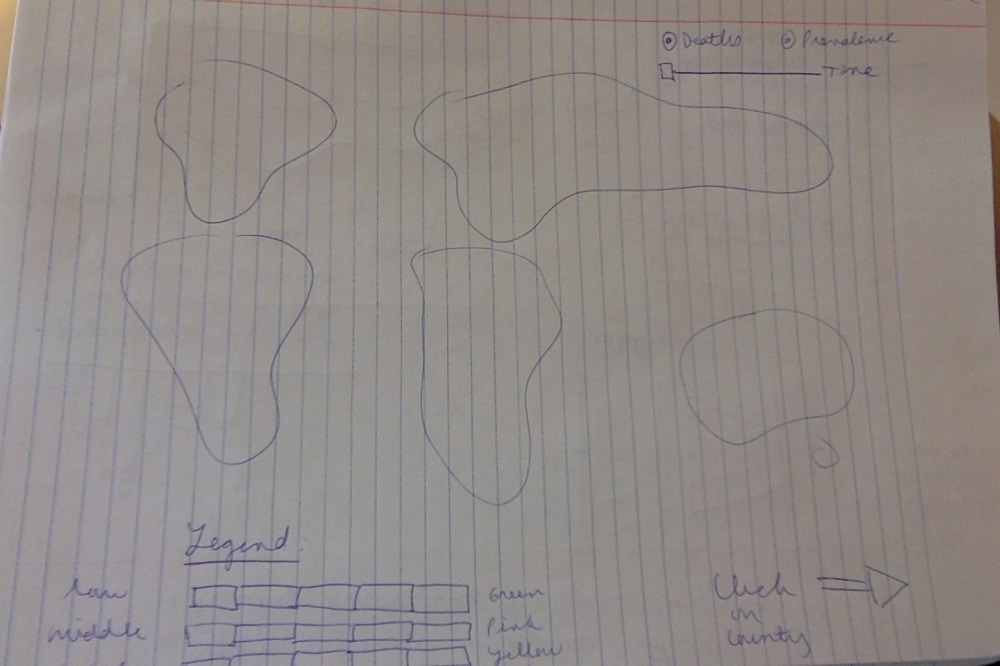
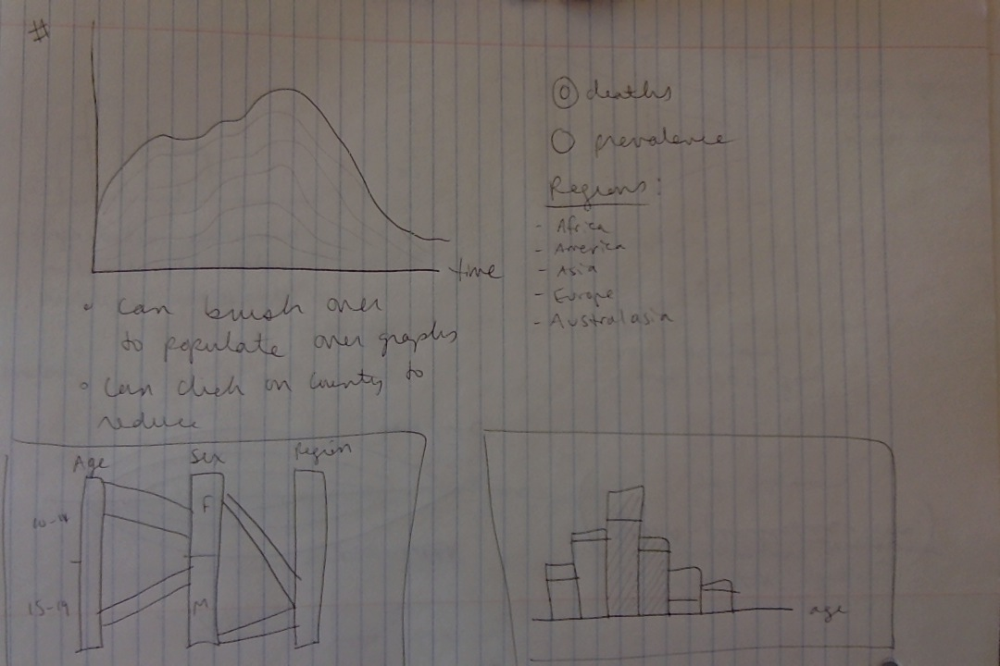
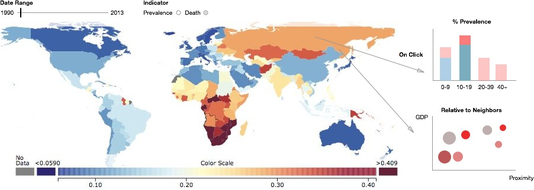

Project Proposal
===

### Background and Motivation. 

Shannon is the founder of a non-profit organization called YBank which aims to increase investment in adolescent health. A project being developed at YBank involves improving adherence to HIV medication amongst HIV positive youth, as they have the poorer mortality rates than adults and children. Inspired by this research, we decided to focus our final project on exploring how HIV has evolved over time in the adolescent population. 

### Project Objectives. 

Through this project we would like to explore:

1. How the HIV epidemic has affected adolescents across the world in terms of prevalence and mortality
2. Which regions and countries are most affected by adolescent HIV over time
3. The relative disease burden placed on adolescents within countries
4. Differences in the disease burden between sexes and if this varies with time or geography

The project will provide a historical perspective of how the disease has evolved in this understudied population. The project will also serve as a tool to understand the current state of the disease amongst adolescents globally. We may also identify patterns across or within countries that can be the subject of future study.  

### Data. 

We are using data from the Global Burden of Disease Study which ranges from 1990 to 2013. The data contains mortality, prevalence and incidence data for multiple age groups, sexes and countries. The data can be found at (http://ghdx.healthdata.org/record/global-burden-disease-study-2013-gbd-2013-hiv-tuberculosis-and-malaria-incidence-prevalence). We may also add in additional data on country GDP which we will source from the World Bank. 

### Data Processing. 

We are beginning from the aforementioned dataset that is a .csv file that has HIV mortality and prevalence data already separated by age, gender, and geography. However, this dataset may require augmentation: for example, geography may require longitude and latitude for visualization, death and prevalence figures may require overall population numbers for context. We expect the data cleanup to be rather minimal in this case.

The key quantities we plan to derive from our data are the death and prevalence figures (and incidence, to a lesser extent, which is available currently only for the most recent year). We are attempting to create a visualization that emphasizes this data on the adolescent population. 

Because of the limited data processing that we expect, we will mostly clean up data with tools with basic R scripts can help join data across relevant categories or reduce data to only the information that is relevant.

### Visualization. 

We plan to make the main visualization a map where death and prevalence are able to be toggled, with different levels of each indicated by color. A legend will be used to identify this information. Additionally, as we have data that spans 1990-2013, we want to show these trends over time with a slider or a similar visual element. Finally, we hope to have smaller visualizations adjacent to the primary map visualization that focuses the data on adolescent health and differentiates based on gender.

# Map Variations

  
  
  
  
  

### Must-Have Features. 

These are features without which you would consider your project to be a failure.

[Work In Progress]

1. Adolescent AIDS prevalence rate for a given year on a global map
2. Adolescent AIDS death rate for a given year on a global map
3. Must show total number on selecting a particular country
4. Must have a comparative visualization showing % rate difference between global population vs adolescent population
5. Must have a comparative visualization showing % rate difference between male and female adolescents
6. Visualization must have a way to toggle between prevalence and death data
7. All the visualizations must be updated to reflect the correct data when user toggles a selection
8. Must have a time slider for users to choose year for which they want to see the data
9. Trend analysis visualization to show the trend for all the countries over the years
10. Must have a filtering mechanism in trend visualization to allow users to filter by country

### Optional Features. 

[Work In Progress]

1. Make trend svg lines clickable to show country specific data
2. Show co-relation between gdp and adolescent aids
3. 

Those features which you consider would be nice to have, but not critical.

### Project Schedule. 

Our project schedule is as follows:

Week 11: Update meeting April 10

- Baishi/Shannon: analyse the data and create proposal visualizations for detailed views to proceed the map
- Sabina: create a prototype of the map visualization
- Shannon: parse and clean the dataset

Week 12: Update meeting April 17

- Baishi/Shannon: prototype assigned visualizations that were selected for inclusion in the project
- Sabina: incorporate feedback/changes into the map visualization

Week 13: Update meeting after TF feedback session

- Baishi: incorporate feedback/changes into assigned visualizations
- Sabina: create interactive features between visualization components
- Shannon: incorporate feedback/changes into assigned visualizations

Week 14: Update meeting May 5

- All: complete interaction between visualization features, complete debugging, incorporate suggested changes and add annotations (if desired)